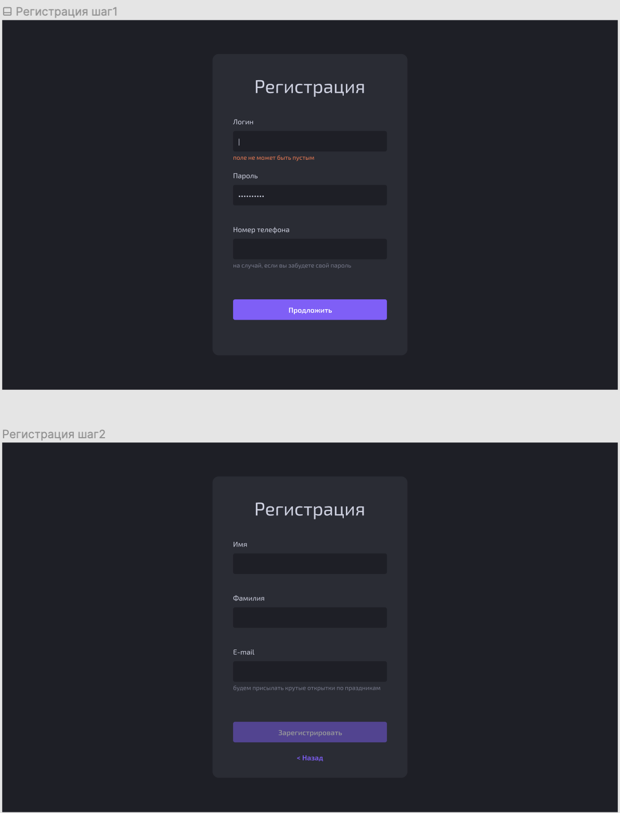

# Тестовое задание по фронтенду

## Задание:
Сделать приложение на React с единственной страницей регистраци

У регистрации 2 шага. По клику на кнопку Продолжить происходит переход на 2й шаг регистрации

Валидация инпутов должна работать по focus/blur событиям. Все поля нужно проверить на пустоту. Поле “пароль” должно быть не менне 8 символов

Поля phone и email должны проверяться любыми соответствующими регулярками

Кнопки продолжить и зарегистрироваться не активны пока корректно не заполнены все поля

По клику на кнопку “Зарегистрироваться” в консоль должен выводится объект со значениями всех полей регистрации 

Кнопка “Назад“ возвращает на предыдущую форму регистрации

Использовать можно только функциональные компоненты и хуки.

Все компоненты должны легко переиспользоваться

**Можно использовать:**

Для сборки CRA

Для стилей СSS/SCSS/PostCSS/Styled Components 

Шрифты можно взять с Google Fonts

Нельзя использовать библиотеки для работы с формами и готовыми компонентами 

**Будут оцениваться**

Приложение дожно работать
Чистота и структура кода
Соответствие макета и дизайна (pixel-perfect не требуется, но похоже на макет должно быть )

This project was bootstrapped with [Create React App](https://github.com/facebook/create-react-app).

## Available Scripts

In the project directory, you can run:

### `yarn start`

Runs the app in the development mode.\
Open [http://localhost:3000](http://localhost:3000) to view it in the browser.

The page will reload if you make edits.\
You will also see any lint errors in the console.

### `yarn test`

Launches the test runner in the interactive watch mode.\
See the section about [running tests](https://facebook.github.io/create-react-app/docs/running-tests) for more information.

### `yarn build`

Builds the app for production to the `build` folder.\
It correctly bundles React in production mode and optimizes the build for the best performance.

The build is minified and the filenames include the hashes.\
Your app is ready to be deployed!
